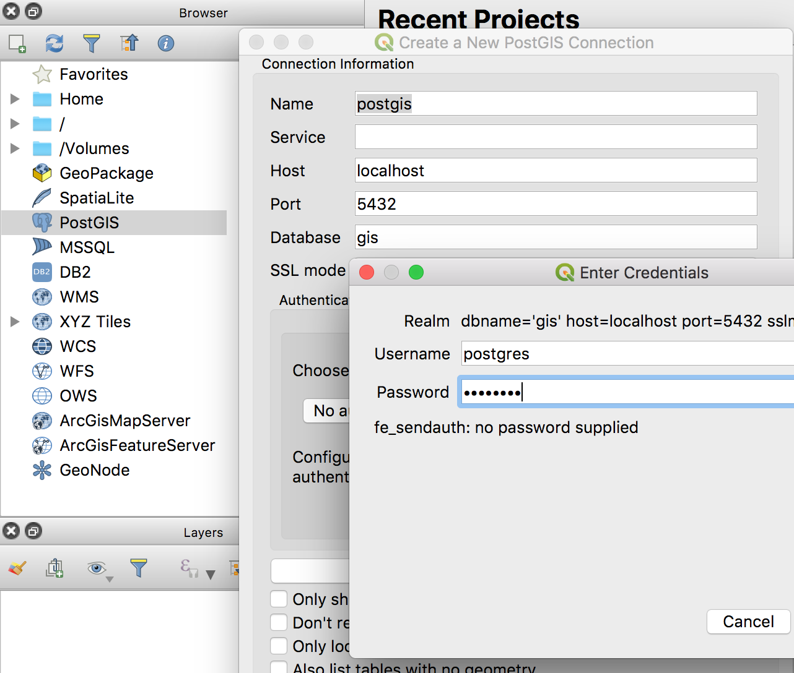
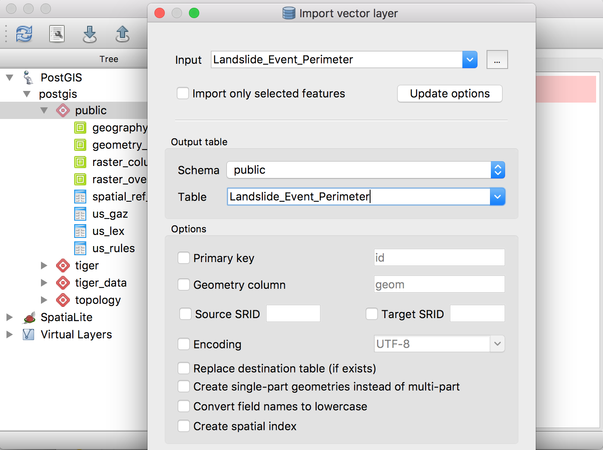
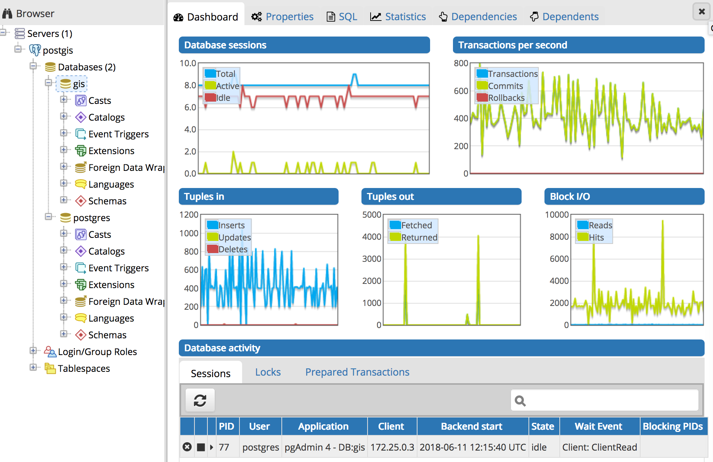
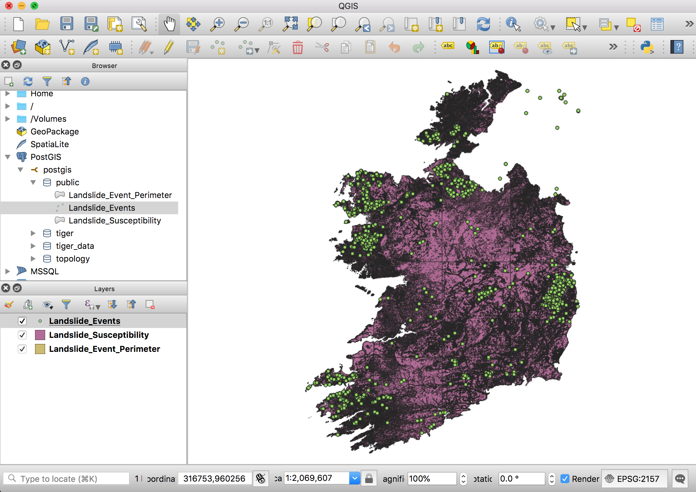

# Loading data with QGIS

In this article, I will show you how to:

1. Install QGIS on Ubuntu Linux.
2. Connect QGIS to PostgreSQL/PostGIS.
3. Import data (shapefiles, GeoJSON) into the GIS database using DBManager.


## 1. Install QGIS:

On Ubuntu Linux, you can use:

```bash
sudo apt-get update
sudo apt-get install qgis
```

For other operating systems, follow the instructions listed at [https://qgis.org/en/site/](https://qgis.org/en/site/
)

### Connect to PostGIS
- Add PostGIS in QGis

1. Under *Browser, Right click *PostGIS* > *New Connection* and select Name: postgis, Host: localhost, Port: 5432.
2. Save the connection details.




## 2. Import Landslide shapefile data into QGIS, then Posgres

### Import the data in QGIS

> First, we import the sample data into QGIS:

1. 'Layer > Data Source Manager > Home' and find the layers
2. Select the layers you wish to add and click the Add Selected Layers button.

### Export the data to PostgreSQL / PostGIS
1. Click on *Database > DB Manager > DB Manager*
2. Select *PostGIS - yourdb > your schema > Table > Import Layer / File and name it (ex: Landslide_Events)
3. Repeat step 2 for every layer you wish to import
4. Close the DB Manager



> Note: The import activity can take a long time. You can monitor progress in the PGAdmin4 Dashboard, by looking at the `Tuples In: Inserts` graph:




### Delete the layers - and load them from the DB

1. In Layers, *right click each layer - Remove*
2. In *Browser > Postgis > postgis > public* - double click each layer (in the right order).


