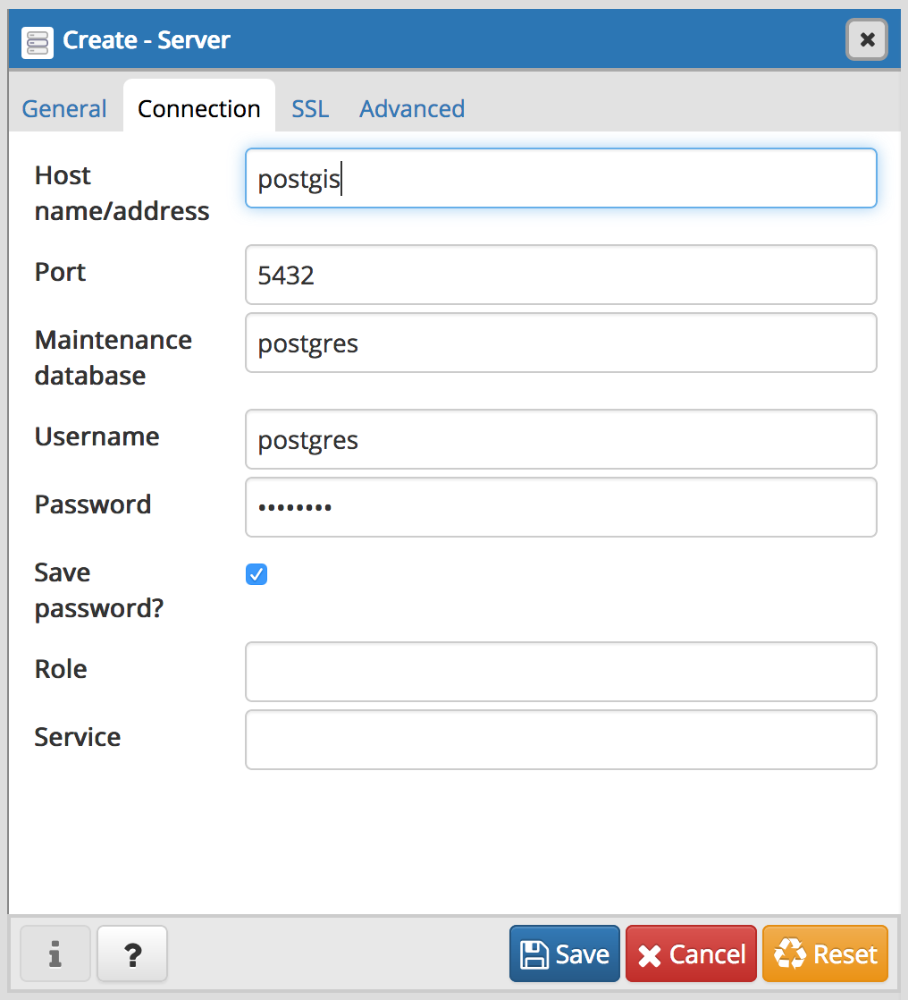
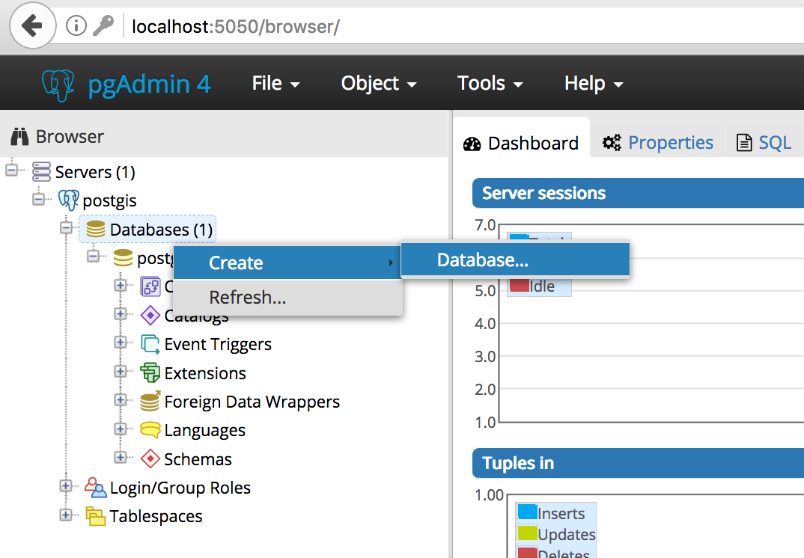
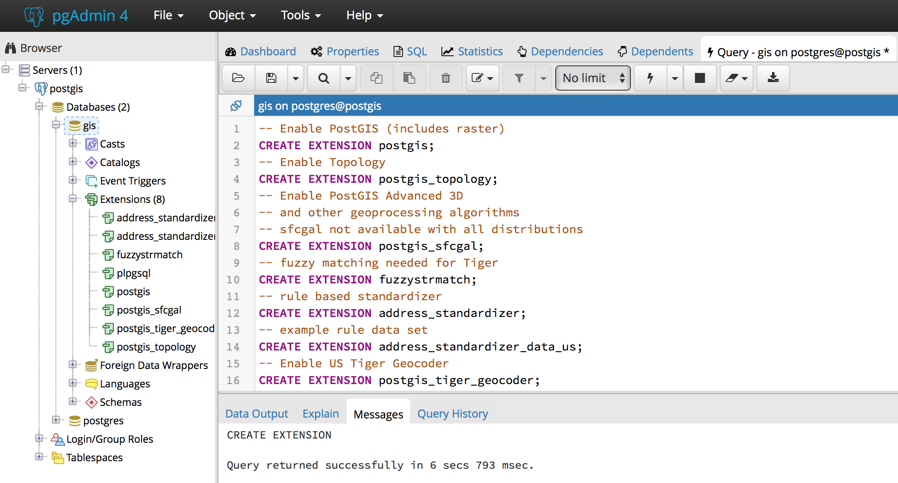

# Docker PostGIS and PGAdmin

In this article, I will show you how to:

1. Create a Postgis docker image `FROM postgres` and publish it to [hub.docker.com](https://hub.docker.com/).
2. Create a Geospacial Database environment in Docker Compose with PostGIS and PGAdmin4.
3. Use PGAdmin4 to create a database an enable Geospacial extensions.


## 1. Build a PostGIS Docker Image

- A `Dockerfile` contains instructions to build an image.
- Start by extending an existing PostgreSQL 10 Debian image: `FROM postgres:10`.
- Use `apt-get` to install required PostGIS extensions.
- Use `docker build` to create the image, then push it to docker hub.

### Creating the `Dockerfile`

```docker
# Extend exiting PostreSQL 10 Debian image: https://hub.docker.com/_/postgres/
FROM postgres:10

MAINTAINER Mihai Criveti

# Install PostGIS packages
RUN apt-get update
RUN apt-get install --no-install-recommends --yes \
    postgresql-10-postgis-2.4 postgresql-10-postgis-2.4-scripts postgresql-contrib
```

### Building the image

- Turn the `Dockerfile` into a usable image using `docker build`.
- Tag the image with a namespace (the one used on Docker Hub): `cmihai`

```bash
docker build --tag cmihai/postgis .
```

### Uploading the image to Docker Hub

1. Push the Dockerfile, README and docker-compose.yaml examples to github
2. Test the image end to end
3. Push the image to docker hub

```bash
export DOCKER_ID_USER="username"
docker login
docker push
docker tag cmihai/postgis $DOCKER_ID_USER/my_image
docker push $DOCKER_ID_USER/my_image
```


## 2. Composing multiple images with docker compose

- PGAdmin4 is a web based PostgreSQL Administration and SQL Development environment.
- Docker Compose can link an existing [dpage/pgadmin4](https://hub.docker.com/r/dpage/pgadmin4/) image from Docker Hub to `cmihai/postgis`
- Login to [http://localhost:5050](http://localhost:5050) `admin`:`admin` after running `docker-compose up`


### Create `docker-compose.yaml`

```yaml
version: '3.1'
services:

    postgis:
        image: cmihai/postgis
        container_name: postgis
        ports:
            - '5432:5432'
        environment:
            POSTGRES_PASSWORD: postgres
        volumes:
            - pgdata:/var/lib/postgresql/data

    pgadmin4:
        image: dpage/pgadmin4
        container_name: pgadmin4
        ports:
            - '5050:80'
        environment:
            PGADMIN_DEFAULT_EMAIL: admin
            PGADMIN_DEFAULT_PASSWORD: admin
        links:
            - postgis

volumes:
  pgdata:

```


### Starting the services

Use `docker-compose up` to start the services:

```
docker-compose up
```

## 3. Create a database and enable PostGIS with PGAdmin4

1. Login to pgadmin4: [http://localhost:5050](http://localhost:5005) with admin:admin

2. Add a connection to postgis with user/pass `postgres`:`postgres` 

3. Create a new database and call it `gis` 

4. Open the SQL Query Tool on the newly created `gis` database: 
In the Browser window, select *Servers > postgis > Databases > gis*, the run *Tools > Query Tool* from the *Menu*.

5. Run the following SQL code to enable postgis database extensions:

```sql
-- Enable PostGIS (includes raster)
CREATE EXTENSION postgis;

-- Enable Topology
CREATE EXTENSION postgis_topology;

-- Enable PostGIS Advanced 3D and other geoprocessing algorithms
CREATE EXTENSION postgis_sfcgal;

-- Fuzzy matching needed for Tiger
CREATE EXTENSION fuzzystrmatch;

-- Rule based standardizer
CREATE EXTENSION address_standardizer;

-- Example rule data set
CREATE EXTENSION address_standardizer_data_us;

-- Enable US Tiger Geocoder
CREATE EXTENSION postgis_tiger_geocoder;
```

### Expected Outcome: `gis` database with geospacial extensions
- `Query returned successfully`:

- *gis > Extensions* now lists a number of GIS extensions: `postgis, postgis_sfgal, postgis_tiger_geocoder, postgis_topology, fuzzystrmatch, address_standardizer and address_standardizer_data_us`.
- *gis > Schema > public > Functions* has been populated with a high number (1000+) of GIS specific functions.
- A new table called `spacial_ref_sys` is now available under *gis > Schemas > public > Tables*.
- New schemas: `tiger`, `tiger_data` and `topology` have been created.

### Next Steps:
- Load Geospacial data from shapefile, KML, GeoJSON, etc.
- Connect GIS Desktop clients such as QGIS.
- Connect to PostGIS using Python (ex: geopandas).
- Perform geospacial queries and analysis on the data.

## Links and Reference:
- Github Repository with Dockerfile and docker-compose.yaml: [https://github.com/crivetimihai/geospacial-engineering](https://github.com/crivetimihai/geospacial-engineering)
- Docker Image: [https://hub.docker/com](https://hub.docker.com)
